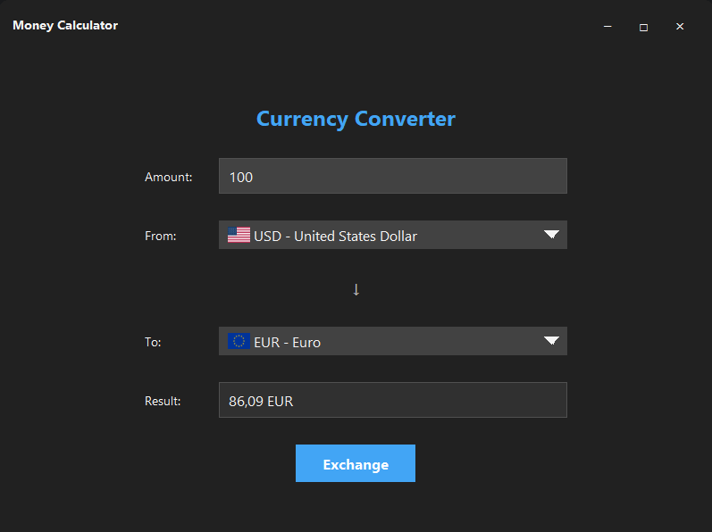

# 💰 Money Calculator

<div align="center">


**A modern desktop application for real-time currency conversion with support for over 160 currencies.**

[📥 Download Latest Release](https://github.com/Cocodrulo/moneycalculator/releases/latest) • [🐛 Report Bug](https://github.com/Cocodrulo/moneycalculator/issues) • [✨ Request Feature](https://github.com/Cocodrulo/moneycalculator/issues)

</div>

---

## 🌟 Features

-   ✅ **Real-time conversion**: Updated exchange rates via ExchangeRate-API
-   🎨 **Modern interface**: Clean and elegant dark design with Swing
-   🌍 **160+ Currencies**: Support for all major world currencies
-   🚀 **Clean architecture**: Well-structured code with separation of concerns
-   🖼️ **Country flags**: Visual flag display for each currency
-   ⚡ **Optimized performance**: Asynchronous image loading and caching

---

## 🖼️ Screenshots

<div align="center">
  
  <p><i>Money Calculator main interface</i></p>
</div>

---

## 📦 Installation

### Prerequisites

-   **Java 21** or higher
-   **Maven 3.6+** (to build from source)

### Direct Download

Download the executable JAR file from the [releases page](https://github.com/Cocodrulo/moneycalculator/releases/latest):

```bash
java -jar moneycalculator-1.0-SNAPSHOT.jar
```

### Build from Source

```bash
# Clone the repository
git clone https://github.com/Cocodrulo/moneycalculator.git
cd moneycalculator

# Build with Maven
mvn clean package

# Run the application
java -jar target/moneycalculator-1.0-SNAPSHOT.jar
```

---

## 🚀 Usage

1. **Enter the amount** you want to convert
2. **Select the source currency** from the dropdown menu
3. **Select the target currency**
4. **Click "Exchange"** to get the result
5. The result will be displayed automatically with proper formatting

---

## 🏗️ Project Architecture

The project follows a **clean architecture** with clear separation of responsibilities:

```
moneycalculator/
├── architecture/           # Architecture layer
│   ├── model/             # Domain models
│   │   ├── Money.java         → Record to represent money (amount + currency)
│   │   ├── Currency.java      → Record for currency data (code, country, image)
│   │   └── ExchangeRate.java  → Exchange rate between two currencies
│   │
│   ├── control/           # Control logic
│   │   ├── Command.java       → Command Pattern interface
│   │   └── ExchangeMoneyCommand.java → Command to execute conversion
│   │
│   ├── io/                # Input/output interfaces
│   │   ├── CurrencyLoader.java      → Interface to load currencies
│   │   └── ExchangeRateLoader.java  → Interface to load exchange rates
│   │
│   └── ui/                # UI interfaces
│       ├── MoneyDialog.java    → Interface to get money from user
│       ├── CurrencyDialog.java → Interface to get selected currency
│       └── MoneyDisplay.java   → Interface to display result
│
└── application/           # Specific implementations
    ├── queen/             # Main implementation with Swing UI
    │   ├── Main.java          → Application entry point
    │   ├── Desktop.java       → GUI implementation
    │   └── WebService.java    → Web services for external API
    │
    └── mock/              # Test implementation with mock data
        ├── Main.java
        ├── MockCurrencyLoader.java
        └── MockExchangeRateLoader.java
```

### 📐 Design Patterns Used

#### 1. **Command Pattern**

```java
public interface Command {
    void execute();
}

// Implementation
public class ExchangeMoneyCommand implements Command {
    @Override
    public void execute() {
        Money money = moneyDialog.get();
        Currency currency = currencyDialog.get();
        ExchangeRate rate = exchangeRateLoader.load(money.currency(), currency);
        Money result = new Money(money.amount() * rate.rate(), currency);
        moneyDisplay.show(result);
    }
}
```

#### 2. **Repository Pattern**

The `CurrencyLoader` and `ExchangeRateLoader` interfaces act as repositories that abstract data retrieval:

```java
public interface CurrencyLoader {
    List<Currency> loadAll();
}

public interface ExchangeRateLoader {
    ExchangeRate load(Currency from, Currency to);
}
```

#### 3. **Model-View-Controller (MVC)**

-   **Model**: `Money`, `Currency`, `ExchangeRate`
-   **View**: `Desktop.java` (Swing interface)
-   **Controller**: `ExchangeMoneyCommand`

#### 4. **Dependency Injection**

The `Main` class injects all necessary dependencies:

```java
Desktop desktop = new Desktop(new WebService.CurrencyLoader().loadAll());
desktop.addCommand("exchange", new ExchangeMoneyCommand(
    desktop.moneyDialog(),
    desktop.currencyDialog(),
    new WebService.ExchangeRateLoader(),
    desktop.moneyDisplay()
));
```

---

## 🔧 Technologies Used

| Technology           | Purpose                                               |
| -------------------- | ----------------------------------------------------- |
| **Java 21**          | Programming language with Records and modern features |
| **Swing**            | GUI framework                                         |
| **Gson**             | JSON parsing and manipulation                         |
| **ExchangeRate-API** | Real-time exchange rate API                           |
| **Flagcdn**          | Country flag service                                  |
| **Maven**            | Dependency management and build                       |

---

## 🌐 External API

The project uses [ExchangeRate-API](https://www.exchangerate-api.com/) to obtain:

-   List of all supported currencies
-   Real-time exchange rates between currency pairs

Flags are loaded from [Flagcdn](https://flagcdn.com/) based on ISO country codes.

---

## 🤝 Contributing

Contributions are welcome! Here's how you can help:

1. **Fork** the project
2. Create a **feature branch** (`git checkout -b feature/AmazingFeature`)
3. **Commit** your changes (`git commit -m 'Add some AmazingFeature'`)
4. **Push** to the branch (`git push origin feature/AmazingFeature`)
5. Open a **Pull Request**

### 📋 Contribution Guidelines

-   Follow the existing code style
-   Write descriptive commits
-   Document significant changes
-   Test your code before submitting PR

---

## 👥 Contributors

<a href="https://github.com/Cocodrulo/moneycalculator/graphs/contributors">
  
</a>

---

## 📊 Project Statistics


---

## 📄 License

This project is licensed under the MIT License. See the [LICENSE](LICENSE) file for details.

---

## ✉️ Contact

**Cocodrulo** - [@Cocodrulo](https://github.com/Cocodrulo)

**Project Link**: [https://github.com/Cocodrulo/moneycalculator](https://github.com/Cocodrulo/moneycalculator)

---

## 🙏 Acknowledgments

-   [ExchangeRate-API](https://www.exchangerate-api.com/) for providing free exchange rates
-   [Flagcdn](https://flagcdn.com/) for country flags
-   [Shields.io](https://shields.io/) for badges
-   [Contrib.rocks](https://contrib.rocks/) for the contributors widget

---

<div align="center">
  
**⭐ If this project has been useful to you, consider giving it a star ⭐**

[](https://star-history.com/#Cocodrulo/moneycalculator&Date)

</div>
